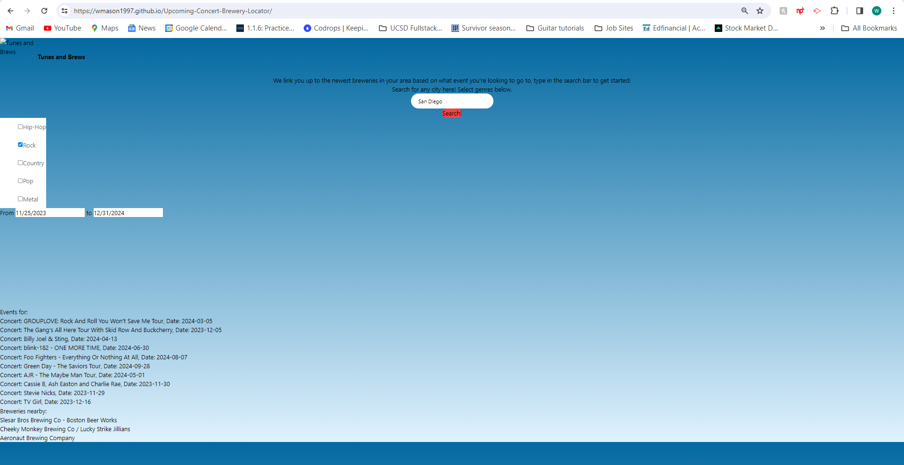
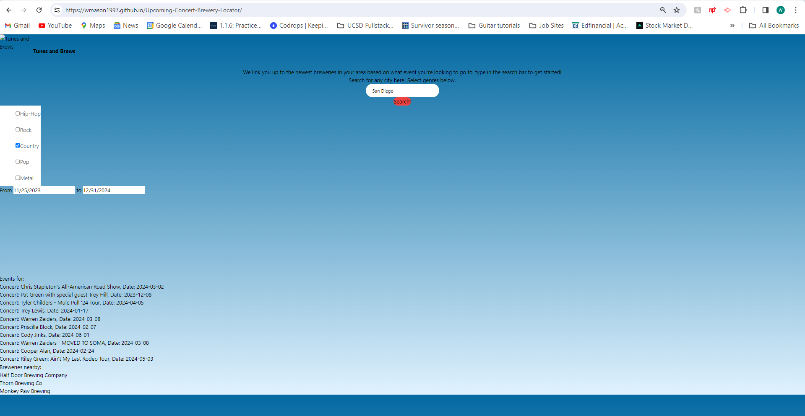
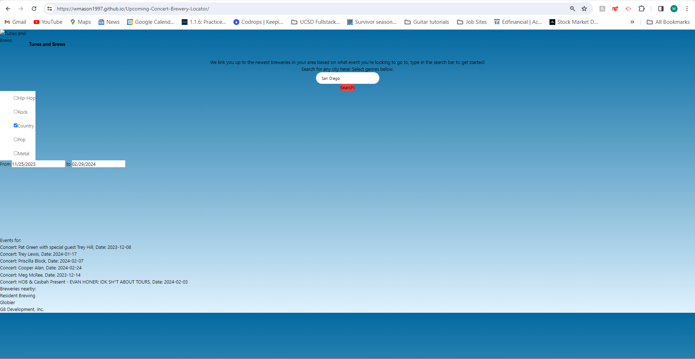

# Tunes and Brews

## Description ##
Have you ever been thinking about wanting to see more live music, but get confused before you get started? Where, when, and what sort of act? Where am I going to loosen up with a couple rounds beforehand? 

Well, fret no more as we have solved this problem with an application that integrates both the TicketMaster API and a brewery locator API. Tunes and Brews allows you to search for music acts and returns top results with the venues’ three nearest breweries.

## Technologies Used ##
JavaScript, CSS, HTML, and Tailwind were the tools we used to make this project. The application was configured in Visual Studio Code as the IDE.
Our two server-side APIs were TicketMaster Discovery API and the Open Brewery DB API. Version control and code review was conducted on GitHub and site is deployed on GitHub pages.

## Credits ##
Team member William Mason had a tutoring session with Scott Everett on 11/15/2023. Scott helped Will to write the showTopTenVenues() function to show ten unique events according to a given ticketmaster search. Thanks Scott!

Team member William Mason used ChatGPT to debug errors in passing start and end dates to getTicketMasterEventsAPI() function from the input forms in the HTML.

Effort was collaborative across team members and there was some overlap with review and debugging, but generally speaking:
Andrew Seatter: HTML set-up, Open Brewery API calls, DOM appending, Tailwind configuration
William Mason: TicketMaster API, passing dates as parameters, client-side storage, presentation
Tabitha Buder: styling

## Screenshot of Logo ##

## Screenshots of Deployed Application ##

## Link to Deployed Application ##
[https://wmason1997.github.io/Upcoming-Concert-Brewery-Locator/](https://wmason1997.github.io/Upcoming-Concert-Brewery-Locator/)

